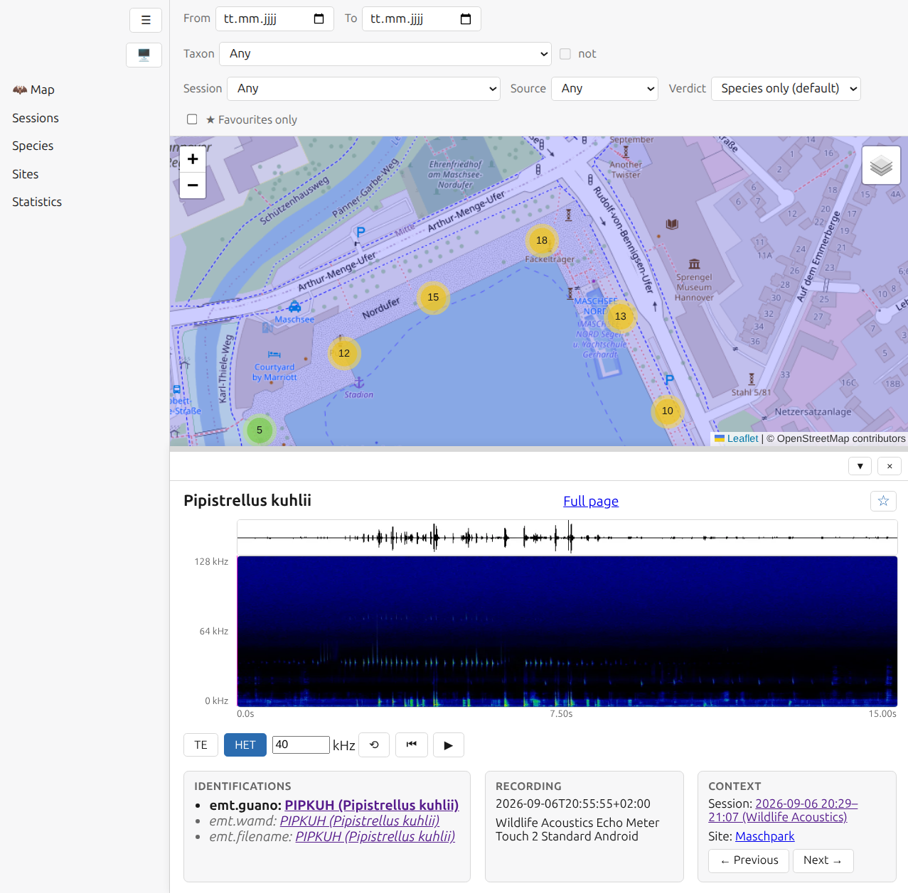

# fledermap

Map-first organiser for bat recordings from handheld detectors. Point it at
the folder your detector (currently Wildlife Acoustics Echo Meter Touch)
syncs its recordings into, and it builds a browsable map of where and when
you recorded, with automatic species identification, session/site
clustering, spectrograms, and audibilised (time-expanded/heterodyne)
playback — all self-hosted, no cloud service involved.

Only Wildlife Acoustics EMT recordings (GUANO/`wamd` metadata plus the
detector's own filename convention) are recognized today — files from other
detectors are silently skipped rather than causing an error. If you'd like
your device supported, please
[open an issue](https://github.com/bytehexe/fledermap/issues) with a sample
recording (subject to a license that allows us to use it as a test
fixture). Species identification natively covers Europe and North America
(USA/Canada) — see the docs for the exact species list.

## Quickstart

1. [Set up Fledermap](docs/how-to/setup.md) — write a config file naming
   your detector's export folder, then `fledermap install`.
2. Sync recordings into that folder as usual — they appear on the map on
   their own, no further action needed.

## Documentation

Everything past this quickstart — how-to guides, reference material, and
the reasoning behind the design — lives at
**https://bytehexe.github.io/fledermap/**. (Not live until the first
tagged release — see [`docs/index.md`](docs/index.md) in the meantime.)

## Built with agentic engineering

Fledermap's code, and most of this documentation, was written by an AI
agent (Claude/Claude Code) working with a human maintainer, not typed by
hand. If that matters to you as a user or a potential contributor — either
way, that's fair — this is stated upfront so you can decide for yourself.

## Security note

Fledermap currently has **no authentication on any route**, and none is
currently planned. Anyone who can reach the host — anyone on the same
network, or further if port-forwarded — has full read/write access. Treat
it accordingly, and if you need authentication,
[open an issue](https://github.com/bytehexe/fledermap/issues) so it can be
prioritized.

## For contributors

See [`docs/contributing.md`](docs/contributing.md).
